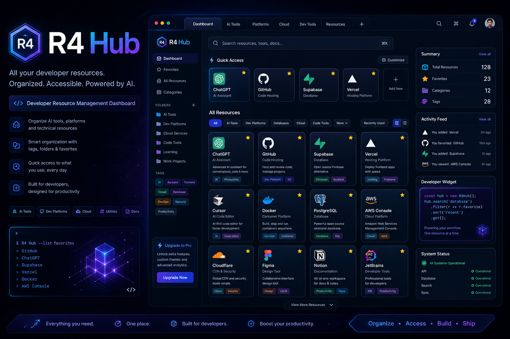

# R4 Hub 🚀

R4 Hub is a personal developer resource management platform designed to help developers organize, save, search, and quickly access technical tools, websites, and learning resources in one place.

As developers continue discovering new AI tools, platforms, documentation websites, deployment services, databases, and experiments, browser tabs and pinned pages quickly become difficult to manage.

R4 Hub solves that problem by creating a centralized personal hub for storing and organizing developer resources.

Live Demo: https://r4-hub.vercel.app/

GitHub Repository: https://github.com/keithowino/r4-hub

Portfolio: https://pickaxe-and-shovel.vercel.app

---

## Preview

Add a screenshot or thumbnail here later:



---

## Features

Current features:

- Add resources
- Categorize resources
- Add tags
- Search resources
- Add notes
- Delete resources
- Copy resource URLs
- Responsive interface
- Resource grouping by categories

Planned features:

- Edit resources
- Import/export resources
- Quick launcher (Ctrl + K)
- Resource analytics
- Collections
- Prompt vault
- Screenshots/thumbnails
- Cloud backup

---

## Tech Stack

Frontend:

- React
- Vite
- Tailwind CSS
- React Router
- React Toastify
- Lucide React

Storage:

- MongoDB

Deployment:

- Vercel

---

## Project Structure

```bash
# structure here...
```

---

## Getting Started

### 1. Fork the repository

Forking creates your own copy of the project under your GitHub account.

Steps:

1. Visit:

https://github.com/keithowino/r4-hub

2. Click the Fork button at the top-right corner.

3. Select your GitHub account.

4. GitHub creates:

https://github.com/YOUR_USERNAME/r4-hub

You now own your own copy.

---

### 2. Clone the repository

Open VS Code terminal and run:

```bash
git clone https://github.com/YOUR_USERNAME/r4-hub.git
```

Move into the project:

```bash
cd r4-hub
```

Open project:

```bash
code .
```

---

### 3. Install dependencies

Install packages:

```bash
npm install
```

or:

```bash
npm i
```

This installs dependencies from package.json.

Examples:

- React
- React Router
- React Toastify
- Lucide React
- UUID
- Tailwind

---

### 4. Start development server

```bash
npm run dev
```

Vite starts:

```bash
http://localhost:5173
```

---

## Available Scripts

Run development:

```bash
npm run dev
```

Build production:

```bash
npm run build
```

Preview build:

```bash
npm run preview
```

---

## Deployment

Project deployed with Vercel.

Deploy:

1. Push repository to GitHub

2. Login to Vercel

3. Import repository

4. Add environment variables

5. Deploy

---

## Contributing

Contributions, issues and feature suggestions are welcome.

Steps:

1. Fork repository

2. Create branch

```bash
git checkout -b feature-name
```

3. Commit changes

```bash
git commit -m "added feature"
```

4. Push:

```bash
git push origin feature-name
```

5. Open Pull Request

---

## Contact

Keith Owino

Email:

[designsolutions1629@gmail.com](mailto:designsolutions1629@gmail.com)

Portfolio:

[https://pickaxe-and-shovel.vercel.app](https://pickaxe-and-shovel.vercel.app)

GitHub:

[https://github.com/keithowino](https://github.com/keithowino)

---

## License

MIT License
